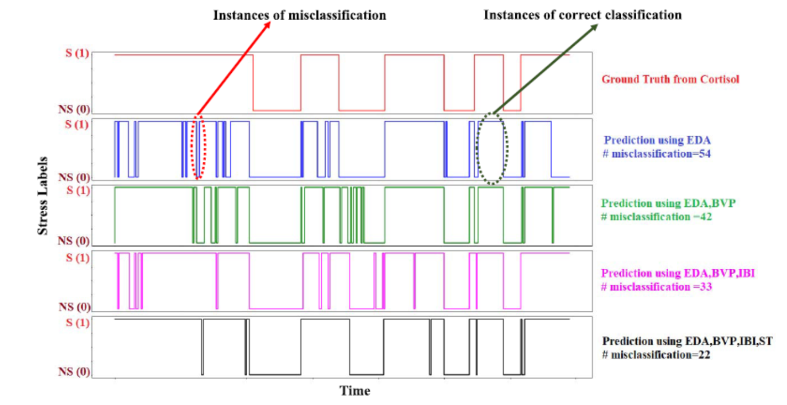

# Stress Detection
```
Implementation of the paper:
R. K. Nath and H. Thapliyal, "Smart Wristband-Based Stress Detection Framework for Older Adults With Cortisol as Stress Biomarker,"
in IEEE Transactions on Consumer Electronics, vol. 67, no. 1, pp. 30-39, Feb. 2021, doi: 10.1109/TCE.2021.3057806.
```

<p align="center"></p>
<em align="center"> Workflow </em>
<p align="center"></p>
<em align="center"> Results </em>

## Experimental Steps
- Get the dataset from here: 'private link'

- Keep the dataset in the dataset folder. You can keep your own dataset for testing purpose.

- Run the ```preprocess.py``` for feature extraction 

- train the model using ```classifier_final.py```


## Cite us with the following bibtex:
```
@ARTICLE{9349773,
  author={Nath, Rajdeep Kumar and Thapliyal, Himanshu},
  journal={IEEE Transactions on Consumer Electronics}, 
  title={Smart Wristband-Based Stress Detection Framework for Older Adults With Cortisol as Stress Biomarker}, 
  year={2021},
  volume={67},
  number={1},
  pages={30-39},
  doi={10.1109/TCE.2021.3057806}}
```
